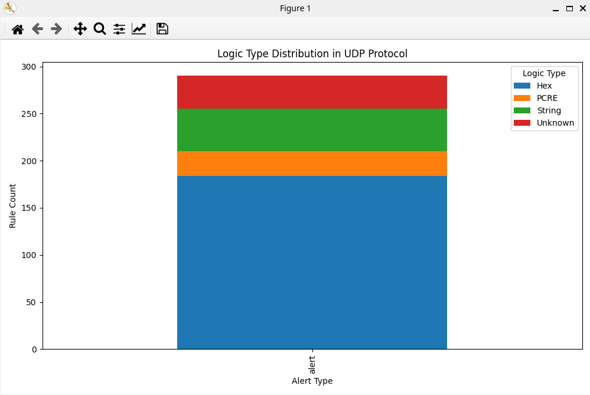
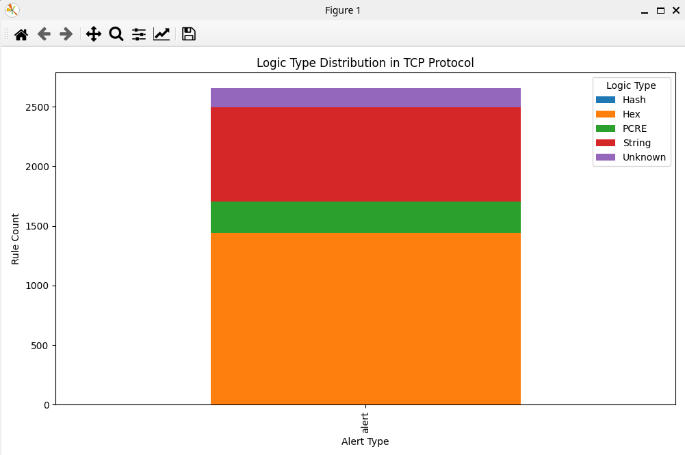
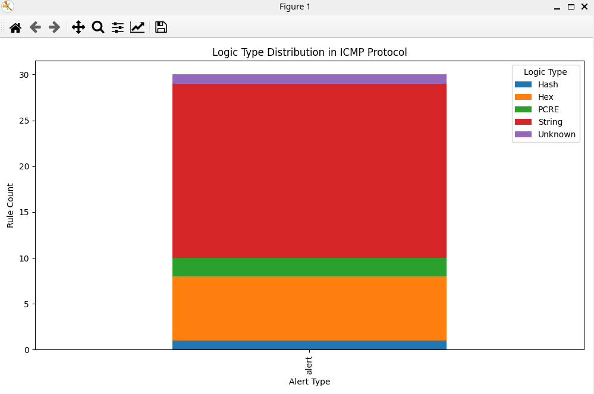
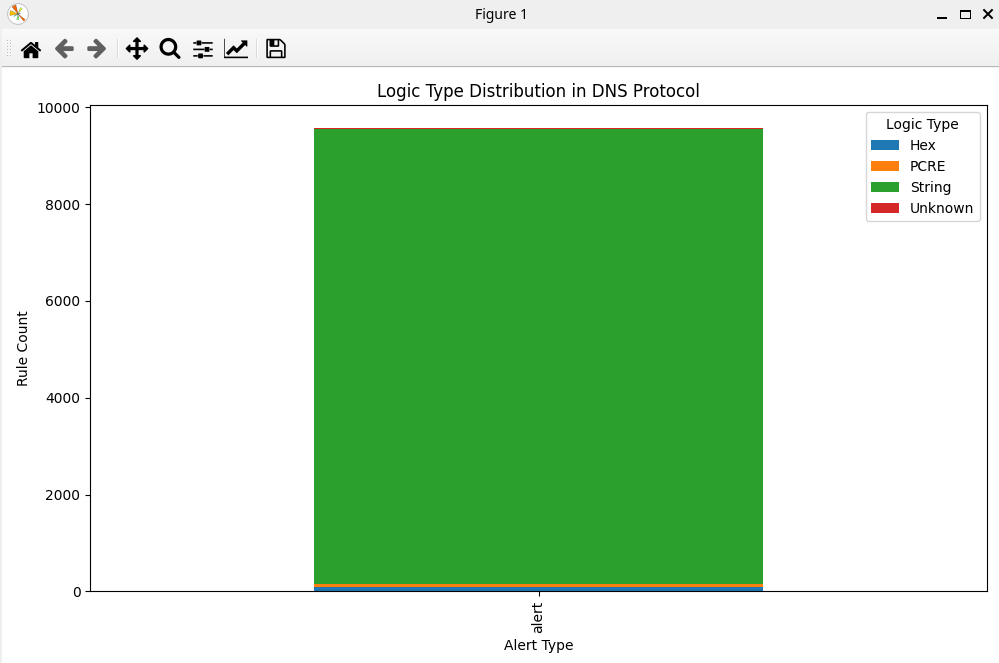
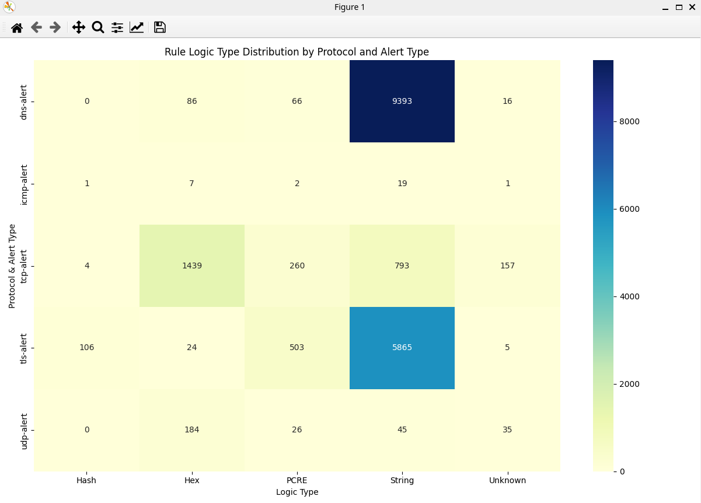

# IDS Rule Inventory Classifier
- This Python tool analyzes and classifies Suricata rules by detecting key signature types such as hex patterns, string matches, PCREs, and file hashes. It assigns a weighted score to each rule based on its indicators, helping developers evaluate rule strength, specificity, and detection coverage.

## 🛠️ Rule inventory analysis
- **What it does**: Automatically classifies thousands of IDS rules into category types.
- **Why it matters**: Helps security teams understand quickly the ruleset structure and focus of their ruleset without manually inspecting each rule.
- **Usecase**: Ideal for validating signature coverage, identifying rule gaps, or auditing open-source rule collections.

For example, it can analyze rule like:
```bash
alert tcp any any -> any any (msg:"ET SHELLCODE Koeln Shellcode"; flow:established; content:"|eb 0f 8b 34 24 33 c9 80 c1|"; content:"|80 36|"; distance:0; content:"|46 e2 fa c3 e8 ec|"; distance:0; classtype:shellcode-detect; sid:2009253; rev:3;)
alert udp any any -> any any (msg:"ET SHELLCODE Koeln Shellcode (UDP)"; content:"|eb 0f 8b 34 24 33 c9 80 c1|"; content:"|80 36|"; distance:0; content:"|46 e2 fa c3 e8 ec|"; distance:0; classtype:shellcode-detect; sid:2009278; rev:2;)
```

## ✅ Supported Categories

| Category                 | Description                                        |
|--------------------------|----------------------------------------------------|
| PCRE                     | Rules using pcre (regex) detection mechanism       |
| Hash                     | Content values resembling MD5, SHA1, SHA256 hashes |
| Hex                      | Rules with hex content payloads (\|00 11 22\|)     |
| String                   | Readable string matchies                           |
| Unknown                  | No recognized indicators                           |

## 🧠 How It Works
Each rule is evaluated through a hierarchical and logical sequence based on well-defined characteristics:

```python
    PRIORITY = {
        "PCRE": 100,
        "Hash": 90,
        "Hex": 80,
        "String": 70,
        "Unknown": 0
    }

    content_values = re.findall(self.content_values, rule)
    pcre_values = re.findall(self.pcre_values,rule)
    matches = []

    for content in content_values:
        content = content.strip()

        if self.hex_pattern.fullmatch(content):
            matches.append("Hex")
        if self.hash_pattern.fullmatch(content):
            matches.append("Hash")
        if self.content_pattern.fullmatch(content) and not content.startswith('|'):
            matches.append("String")

    for _ in pcre_values:
        matches.append("PCRE")

    if not matches:
        return {
                "primary":"Unknown",
                "total_score":0,
                "matched":[]
                }

    match_counts = defaultdict(int)
    for m in matches:
        match_counts[m]+=1

    # Score system
    category_scores = { cat: PRIORITY[cat]*count
    for cat, count in match_counts.items()}

    primary = max(category_scores, key=category_scores.get)
    total_score = category_scores[primary]
```

Example hex pattern match:
```bash
alert tcp any any -> any any (msg:"ET SHELLCODE Koeln Shellcode"; flow:established; content:"|eb 0f 8b 34 24 33 c9 80 c1|"; content:"|80 36|"; distance:0; content:"|46 e2 fa c3 e8 ec|"; distance:0; classtype:shellcode-detect; sid:2009253; rev:3;)
```
Output where `Hex` was chosen as the primary detection signature:
```bash
2025-05-26 11:34:28,261 - INFO - [DEBUG] Category counts: {'Hex': 3}
2025-05-26 11:34:28,261 - INFO - [DEBUG] Weighted scores: {'Hex': 240}
2025-05-26 11:34:28,261 - INFO - [DEBUG] Primary:, Hex
```

By evaluating the checks based on these semantics, it reflects:
- Suricata’s matching pipeline (e.g., fast pattern matching followed by deeper content or PCRE evaluation).
- The likely detection outcome of a rule — for example, a rule that relies heavily on hex content suggests the detection is based on specific binary patterns observed in malicious traffic.

## 🔢 Scoring system
| **Indicator**       | **Score** | **Rationale**                                                                     |
| ------------------------ | --------- | --------------------------------------------------------------------------------- |
| **PCRE**                 | 100       | Very specific, rare, and computationally expensive but highly accurate            |
| **Hash**                 | 90        | Extremely precise; represents known malicious files with low false positive rates |
| **Hex**                  | 80        | Matches binary patterns; often tied to specific exploits or shellcode             |
| **String**               | 70        | Matches common strings; useful but can be prone to false positives                |
| **Unknown**              | 0         | No identifiable signature type detected                                           |

## 📂 File structure
- classify.py          
- emerging-all.rules.txt
- requirements.txt
- README.md
- pictures

## ✅ Requirements
- Python 3.7+
- Dependencies specified in `requirements.txt`

## 📌 Notes
- It is under continous development as more features and refinements are about to be added.

## 📦 Usage
1. Clone the repository on your local machine:
```
git clone https://github.com/olofmagn/classify
```

2. Install requirements:
```bash
pip3 -r install requirements.txt
```

3. Run the script:
```python
python3 classify.py -i emerging-all.rules.txt 
```

Result based on the logic `(alert) && (tcp|udp|icmp|dns|tls)`:
```
Protocol: UDP
Alert type: alert
Hex: 184
String: 45
Unknown: 35
PCRE: 26

Protocol: TCP
Alert type: alert
Hex: 1439
String: 793
Unknown: 157
PCRE: 260
Hash: 4

Protocol: ICMP
Alert type: alert
Hex: 7
String: 19
Hash: 1
PCRE: 2
Unknown: 1

Protocol: DNS
Alert type: alert
Unknown: 16
Hex: 86
String: 9393
PCRE: 66

Protocol: TLS
Alert type: alert
String: 5865
Hash: 106
Hex: 24
Unknown: 5
PCRE: 503
```







## 📝 License
This project is open-source and licensed under the MIT License. See the LICENSE file for details.
